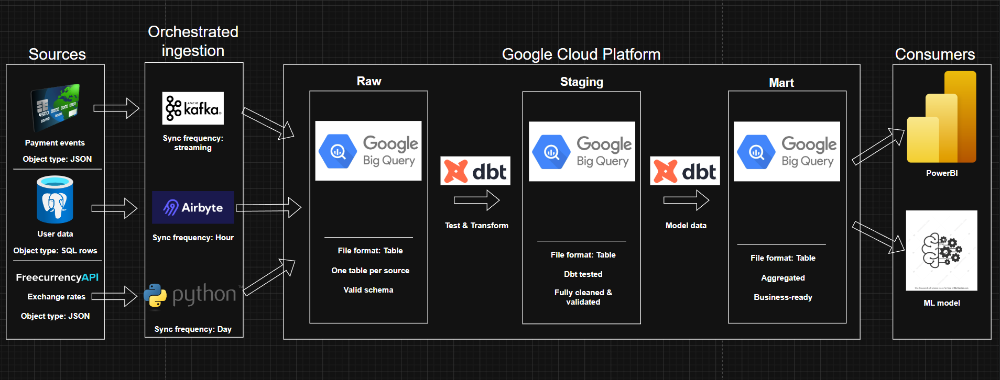
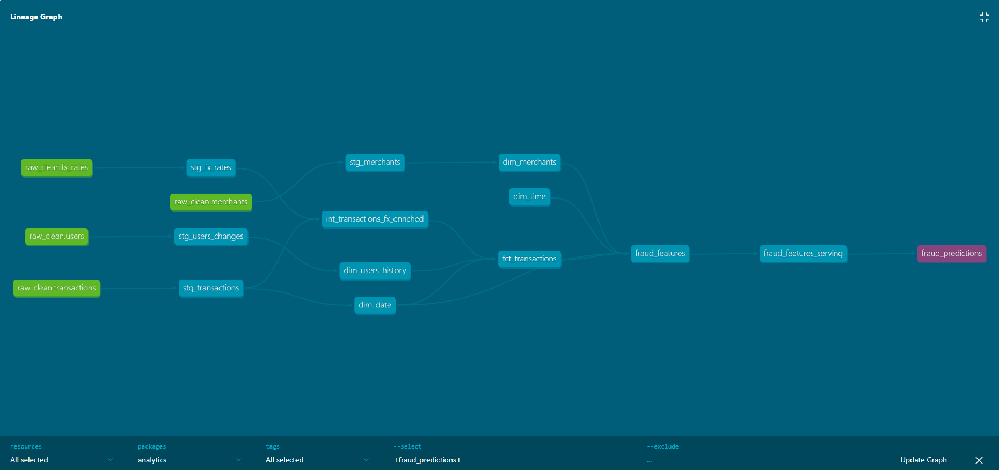
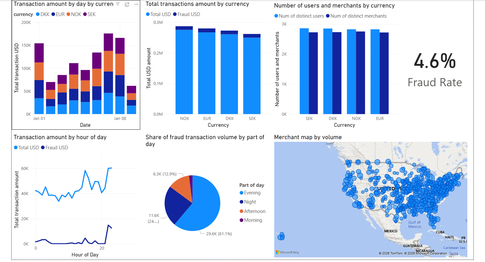

# Financial Transactions Analytics Platform

End-to-end **data engineering and analytics** for payment-like data: streaming ingestion into the cloud, relational dimensions with **CDC**, **dbt** transformations in **BigQuery**, **Power BI** reporting, and **BigQuery ML** fraud scoring.

---

## Summary

This project demonstrates how a financial analytics organization can combine **high-volume transaction events**, **slowly changing reference data**, and **market data** into a single analytics layer suitable for KPI dashboards and fraud detection.

| Tool | Role in this project |
|------|----------------------|
| **Docker Compose** | Local stack: Kafka, Zookeeper, PostgreSQL, producers/consumers, batch cron. |
| **Apache Kafka** | Durable event bus between transaction producer and streaming consumer. |
| **Python** | Producers/consumers, batch jobs (`uv` / pandas / pyarrow). |
| **PostgreSQL** | System of record for users and merchants; logical replication for CDC. |
| **Google Cloud Storage** | Landing zone for Parquet: `transactions/` and `fx_rates/`. |
| **BigQuery** | Warehouse: external or loaded tables, dbt models, BQML logistic regression. |
| **dbt** | Versioned SQL, tests, documentation, medallion-style layers (`staging` → `intermediate` → `marts` / `features`). |
| **Google Cloud Build** | CI: on push to **`main`**, build dbt Docker image, push to **Artifact Registry**, update **Cloud Run Job**. |
| **Cloud Run Jobs** | Runs containerized `dbt build` (or equivalent) against BigQuery with mounted credentials. |
| **FreeCurrencyAPI** | External FX rates for amount normalization and time-series context. |
| **Power BI** | Semantic model and report under `bi_reports/` on top of dbt marts. |

---

## 1. Business requirements and design mapping

| Requirement | Why it matters | How this repo addresses it |
|-------------|----------------|------------------------------|
| **Ingest payments as a stream** | Card authorizations arrive continuously; batch-only ingestion misses operational monitoring and near-real-time risk signals. | CSV-backed **producer** replays realistic events into Kafka; **consumer** subscribes and (optionally) lands **batched Parquet** to GCS—mirroring a bounded stream-to-lake pattern. |
| **Trustworthy customer and merchant dimensions** | Analytics and fraud features need stable IDs and attributes that **change over time** (address, job, etc.). | **PostgreSQL** holds `users` and `merchants`; a scheduled **update_users** job simulates dimension changes. |
| **Propagate DB changes efficiently** | Full nightly dumps of large dimensions are expensive and lose change timing. | Postgres runs with **`wal_level=logical`**, a replication slot, and a publication (**CDC-ready**) so tools like Airbyte can sync **incremental** changes to the warehouse. |
| **FX context for amounts** | Multi-currency reporting and risk features need rates at a point in time. | **ingest_fx** calls **FreeCurrencyAPI** on a schedule and writes **Parquet** under `fx_rates/` for joins in analytics. |
| **Curated analytics & governance** | Raw files and tables are not enough for consistent KPIs and compliance-friendly logic. | **dbt** implements staging, intermediate enrichment, **marts** (facts/dims, KPI tables), and **feature** models feeding ML predictions. |
| **Operational insight (dashboards)** | Business users need self-serve exploration of volume, fraud rate, and segments. | **Power BI** project in `bi_reports/` connects to BigQuery datasets produced by dbt. |
| **Fraud detection** | Fraud is rare; models must be **interpretable** and **tunable** for precision/recall trade-offs. | **BigQuery ML** `logistic_reg` model trained from `fraud_features`; serving applies a **probability threshold** tuned below 0.5 for imbalanced labels (see [ML](#7-ml-model-fraud-detection)). |

**Note on schedules:** Pushes to `main` **rebuild and redeploy** the dbt job image (continuous delivery). **How often dbt runs** in production is a separate concern: use **Cloud Scheduler** to invoke the Cloud Run Job (for example **daily** batch analytics) independent of code changes. Local **batch-cron** schedules **FX ingestion** and **user updates** via environment variables (see [Configuration](#configuration)).

---

## 2. Dataset

- **Source:** [Credit Card Transactions Dataset](https://www.kaggle.com/datasets/priyamchoksi/credit-card-transactions-dataset) on Kaggle (downloaded in code via **`kagglehub`** as `priyamchoksi/credit-card-transactions-dataset`).
- **Preparation:** [`scripts/prepare_data.py`](scripts/prepare_data.py) reads the consolidated CSV and writes three artifacts:
  - **`sources/transactions/credit_card_transactions_events.csv`** — transaction stream fields (time, user, merchant, category, amount, fraud label, etc.).
  - **`sources/postgres/init/data/credit_card_transactions_users.csv`** — one row per **user** (profile attributes).
  - **`sources/postgres/init/data/credit_card_transactions_merchants.csv`** — one row per **merchant** (geo, zip).

Stable **`user_id`** values are generated deterministically from name keys so the same person joins cleanly across events and dimensions.

---

## 3. Sources

| Source | Description |
|--------|-------------|
| **PostgreSQL** ([`sources/postgres/`](sources/postgres/)) | `users` and `merchants` loaded at container init from the CSVs above. Logical replication and publication support CDC consumers. Host port **5433** → container **5432**. |
| **Transaction producer** ([`sources/transactions/`](sources/transactions/)) | Reads the events CSV, enriches with currency metadata, publishes JSON to Kafka topic **`transactions`**, with checkpointing for replay/resume. |
| **FreeCurrencyAPI** ([`ingestion/batch/ingest_fx/`](ingestion/batch/ingest_fx/)) | REST API for exchange rates; batch job writes timestamped Parquet to GCS under **`fx_rates/`**. |

---

## 4. Ingestion

### Architecture

End-to-end flow from sources through ingestion to BigQuery medallion layers and consumers (Power BI, ML):



- **Kafka:** Decouples event production from consumption, allows multiple consumers, and matches how payment networks and issuers integrate around topics.
- **CDC:** Postgres is configured for logical replication so **dimension changes** (from `update_users` or real applications) can flow incrementally to BigQuery or other stores without full-table extracts.
- **API + GCS:** FX is **append-only, small payloads**—ideal for a scheduled pull into object storage rather than a streaming socket.

**Implementation notes:**

- **Consumer:** Time-based buffer flush to GCS (default **10 minutes**, `GCS_FLUSH_SECONDS`) to limit object count while keeping files analytics-friendly.
- **Formats:** JSON on the wire; **Parquet** in GCS for columnar analytics and BigQuery loads/external tables.
- **Local orchestration:** [`docker-compose.yml`](docker-compose.yml) wires Zookeeper, Kafka, Postgres, producer, consumer, and **`batch-cron`** (single image running cron + both batch scripts).

Module-level detail: [`ingestion/streaming/README.md`](ingestion/streaming/README.md), [`ingestion/batch/README.md`](ingestion/batch/README.md).

---

## 5. Analytics

### Why dbt

- **SQL-first transformations** with reusable refs, clear dependencies, and automated **documentation/lineage**.
- **BigQuery** as execution engine scales with fact volume; **dbt** supplies testing and environment-aware project config ([`analytics/dbt_project.yml`](analytics/dbt_project.yml)).

### Medallion-style layout

| Layer | Folder | Purpose |
|-------|--------|---------|
| **Sources** | [`models/sources/raw_clean.yml`](analytics/models/sources/raw_clean.yml) | Declares `raw_clean` tables (transactions, fx_rates, merchants, users). |
| **Staging** | `models/staging/` | Typed, renamed, lightly cleaned views/tables (`stg_*`). |
| **Intermediate** | `models/intermediate/` | Joins/enrichment (e.g. FX-enriched transactions). |
| **Marts** | `models/marts/core/`, `models/marts/dashboard/` | Dimensions, facts, and **KPI marts** for BI (`mart_kpi_*`). |
| **Features / ML** | `models/features/` | Feature sets and **`fraud_predictions`** via `ML.PREDICT`. |

Schemas are split via dbt config (e.g. `staging` vs `analytics` / `analytics_ml` for predictions).

### Data lineage (dbt)

Lineage from `raw_clean` sources through staging, facts/dimensions, feature models, to `fraud_predictions` (export from **dbt docs**; copy kept in-repo):



To regenerate after model changes (with BigQuery profile configured):

```bash
cd analytics
dbt docs generate
dbt docs serve
```

### CI/CD (GCP)

A **Cloud Build trigger** on commits to the **`main`** branch runs [`analytics/cloudbuild.yml`](analytics/cloudbuild.yml):

1. **`docker build`** — builds the dbt image from [`analytics/Dockerfile`](analytics/Dockerfile) (`dbt-bigquery`, project files, default `CMD ["build"]`).
2. **`docker push`** — pushes to **Artifact Registry** (`europe-north2-docker.pkg.dev/$PROJECT_ID/dbt-repo/dbt-fraud-job:latest`).
3. **`gcloud run jobs update`** — updates Cloud Run Job **`dbt-fraud-analytics`** to the new image (region **`europe-north2`** in the checked-in config).

Credentials for dbt in GCP typically use a mounted service account (see comments in [`analytics/profiles/profiles.yml`](analytics/profiles/profiles.yml) and the Dockerfile’s `GOOGLE_APPLICATION_CREDENTIALS`).

**Runtime schedule:** Image updates happen on every qualifying push. For **daily** (or hourly) analytics runs, attach **Cloud Scheduler** to execute the Cloud Run Job on a cron—aligned with business SLAs without rebuilding on each run.

---

## 6. Dashboards

Power BI artifacts live under [`bi_reports/`](bi_reports/) (semantic model + report definitions wired to BigQuery marts such as `mart_kpi_daily`, `mart_kpi_user_daily`, `mart_kpi_currency_daily`, etc.).

Example overview page: volume and fraud by **currency** and **time**, **fraud rate** KPI, activity **by hour** and **by part of day**, distinct **users/merchants** by currency, and **merchant geography** by volume.



---

## 7. ML model (fraud detection)

- **Algorithm:** **BigQuery ML logistic regression** (`model_type = 'logistic_reg'`), defined in [`analytics/macros/train_fraud_lr_v1.sql`](analytics/macros/train_fraud_lr_v1.sql). It is **interpretable**, trains in-database on `fraud_features`, and scores with `ML.PREDICT` in [`analytics/models/features/fraud_predictions.sql`](analytics/models/features/fraud_predictions.sql).
- **Class imbalance:** Fraud is a small fraction of transactions (under **1%** in the source data). A default **0.5** probability cutoff would favor the majority class and hurt recall on fraud. This project sets **`fraud_probability_threshold: 0.1`** in [`analytics/dbt_project.yml`](analytics/dbt_project.yml) and uses it when deriving **`predicted_fraud`**, lowering the bar for a positive prediction to trade off precision and recall toward a better **F1**-style balance for rare events.
- **Serving:** Predictions materialize as a table in **`analytics_ml`** (see model config in `fraud_predictions.sql`); override **`bqml_model_fqn`** with `--vars` if your project/dataset/model name differs.

---

## Repository layout

| Path | Description |
|------|-------------|
| [`sources/`](sources/) | Postgres image + init SQL; Kafka transaction producer. |
| [`ingestion/`](ingestion/) | Streaming consumer; batch jobs (`ingest_fx`, `update_users`) and cron runner. |
| [`scripts/`](scripts/) | `prepare_data.py` — download/split Kaggle data. |
| [`analytics/`](analytics/) | dbt project, Dockerfile, Cloud Build config. |
| [`bi_reports/`](bi_reports/) | Power BI project. |
| [`docker-compose.yml`](docker-compose.yml) | Local platform services. |
| [`credentials/`](credentials/) | *(Not committed)* Mount GCP service account JSON here for local GCS upload. |

---

## Prerequisites

- **Docker** and **Docker Compose**
- **Python** (for data prep): dependencies for `scripts/` (e.g. `pandas`, `kagglehub`)
- **Optional — full cloud path:** GCS bucket, GCP service account key, `FREECURRENCYAPI_API_KEY`, BigQuery datasets matching dbt sources, dbt profile env vars (`DBT_GCP_PROJECT`, `DBT_BIGQUERY_DATASET`, etc.)

---

## Quick start (local)

1. **Prepare data** (from repo root):

   ```bash
   python scripts/prepare_data.py
   ```

   Ensure the output CSV paths under `sources/` exist before first Postgres start.

2. **Environment:** Set `POSTGRES_DB`, `POSTGRES_USER`, `POSTGRES_PASSWORD`. For GCS uploads, set `GCS_BUCKET_NAME` and `GOOGLE_APPLICATION_CREDENTIALS` (path inside containers often under `/app/credentials/...` when using the compose volume).

3. **Run:**

   ```bash
   docker compose up -d
   ```

4. **Logs:** `docker logs transactions_producer`, `docker logs transactions_consumer`, `docker exec batch-cron cat /var/log/ingest-fx.log` (and `update-users.log`).

---

## Configuration (high level)

| Variable | Used by | Purpose |
|----------|---------|---------|
| `POSTGRES_*` | Postgres, batch-cron | Database connection. |
| `KAFKA_BROKER` | Producer, consumer | Kafka bootstrap servers. |
| `GCS_BUCKET_NAME`, `GOOGLE_APPLICATION_CREDENTIALS` | Consumer, batch-cron | GCS upload path and auth. |
| `GCS_FLUSH_SECONDS` | Consumer | Flush interval for transaction Parquet. |
| `FREECURRENCYAPI_API_KEY` | ingest_fx | FX API authentication. |
| `INGEST_FX_SCHEDULE`, `UPDATE_USERS_SCHEDULE` | batch-cron | Cron lines for FX and user updates. |
| `DBT_GCP_PROJECT`, `DBT_BIGQUERY_DATASET`, … | dbt | BigQuery target (see `analytics/profiles/profiles.yml`). |

---

## License

[Apache License 2.0](LICENSE).
